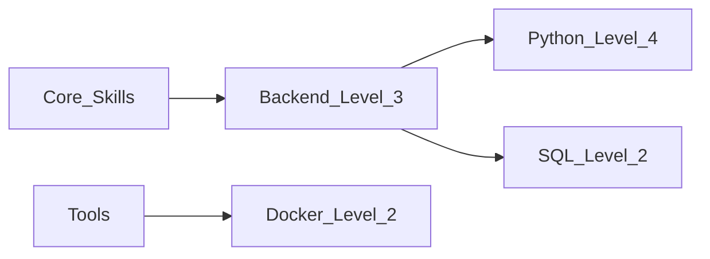

**Gamifying Stacklava is a *brilliant* idea.**
It turns a static “skills catalog” into a **personal growth engine**, and creates a use case StackShare and all resume tools completely miss.

Here are **10 gamification mechanics** that naturally fit the concept of a “tech skill stack” — all executable in a CLI MVP and expandable later to a web dashboard or mobile app.

---

# 🎮 **1. Skill Levels → XP System**

Each tech item (Python, React, Docker, etc.) becomes a “skill” with XP and a level, like an RPG.

Example levels:

| Level | Meaning      |
| ----- | ------------ |
| 1     | Novice       |
| 2     | Beginner     |
| 3     | Intermediate |
| 4     | Advanced     |
| 5     | Expert       |

You grant XP through:

* learning sessions
* projects completed
* tutorials watched
* certifications earned
* quizzes passed

CLI example:

```
stacklava gain-xp python 40
stacklava levelup python
```

---

# 🏆 **2. Achievements / Badges**

Stacklava can automatically award badges like:

* **“Pythonic Apprentice”** — reached Python Level 3
* **“Docker Diver”** — built 5 containers
* **“Cloud Climber”** — deployed first cloud app
* **“Data Wrangler”** — built 3 SQL queries in a row
* **“Full Stack Flame”** — backend + frontend above level 2
* **“Baklava Layer Master”** — completed all layers

And they show up on your résumé export or personal site.

---

# 📅 **3. Daily Challenges / Streaks**

Encourage consistent learning:

* “Learn for 25 minutes today → +10 XP”
* “Solve one coding challenge → +5 XP”
* “Watch a tutorial → +3 XP”

CLI:

```
stacklava challenge complete "25min_learning"
```

Maintains a streak counter (like Duolingo).

---

# 🔥 **4. Layer Heatmaps (the Baklava metaphor)**

Use Stacklava’s layered concept:

* Core Skills
* Tools
* Frameworks
* Cloud/DevOps
* Architecture & Design

Each layer has a “heat score” computed from XP levels.
You visualize it with:

* ASCII heatmaps
* Mermaid color-coded nodes
* Dashboard graphics later

This is inherently *gamified feedback*.

---

# 💼 **5. Job-Fit Scoring**

Given a job description YAML or pasted text, Stacklava can compute a “fit score” based on your skill XP.

```
stacklava jobscore job.yaml
```

Return example:

```
Backend Engineer Fit: 72%
Strong: Python, SQL
Weak: Kubernetes, AWS IAM
Recommended XP to gain:
 - +40 Kubernetes
 - +30 AWS IAM
```

**THIS is a killer differentiator** — gamified job leveling.

---

# 🎯 **6. Quests (Learning Plans)**

Quests are structured sequences:

```
Quest: Become a Docker Intermediate
Steps:
  ( ) Learn basics
  ( ) Build your first image
  ( ) Use docker-compose
  ( ) Publish to registry
Reward: +80 XP, badge: Docker Diver
```

CLI:

```
stacklava quest list
stacklava quest start docker_intermediate
stacklava quest complete step 2
```

Quests = your learning roadmap turned into a game.

---

# 📊 **7. Personal Progress Graphs**

Track:

* cumulative XP
* level-ups over time
* which skills are stagnating
* which layers improved

Later these can export to SVG charts or Quarto dashboards.

---

# 💥 **8. Skill Synergy Bonuses**

When two skills enhance each other, Stacklava can give combo XP multipliers.

Examples:

* Python + FastAPI → +10 synergy XP
* Docker + Kubernetes → +15 XP
* React + TypeScript → +10 XP

This makes progression feel fun.

---

# 📚 **9. Knowledge Trees (like tech-skill RPG trees)**

Visual breakdown:

Python →
├─ Syntax
├─ OOP
├─ Async
├─ Data Analysis
└─ Web (Flask/FastAPI)

Earning XP in subcategories can level the parent skill.

---

# ❤️ **10. Personal “Stack Persona”**

Using the baklava layer metaphor, Stacklava can generate a persona such as:

* “Full-Stack Fireweaver”
* “Data Alchemist”
* “DevOps Forgewright”
* “Cloud Pathfinder”

It’s silly but *people LOVE this kind of branding* for portfolio sites.

---

# 🧱 **How to build the MVP gamification fast**

Start extremely simple:

### **Data Model (YAML or JSON)**

```yaml
skills:
  python:
    xp: 120
    level: 3
  docker:
    xp: 40
    level: 1

badges: []
streak: 5
```

### **CLI Actions**

```
stacklava add-xp python 20
stacklava levelup python
stacklava badge grant pythonic_apprentice
stacklava streak increment
```

### **Visual Output**

Use Mermaid or D2 to render:

* level nodes
* heatmaps
* layered diagrams

Example (Mermaid flow chart for your “Tech Persona”):



---

# 🧨 **What you now have that StackShare will never have**

StackShare is static, SaaS, catalog-y.

**Stacklava becomes a personal skill RPG.**
People *will* use it because it helps them actually grow, not just list tech.

This is a huge differentiator.

---

# 🧁 Want next steps?

I can help you:

### ✔ design the **gamification data model**

### ✔ define **XP rules**

### ✔ create **badges/quests**

### ✔ draft the **CLI MVP**

### ✔ create **Mermaid/D2 visualization templates**

### ✔ propose a **branding aesthetic** around “baklava layers”

Which direction should we tackle next?


