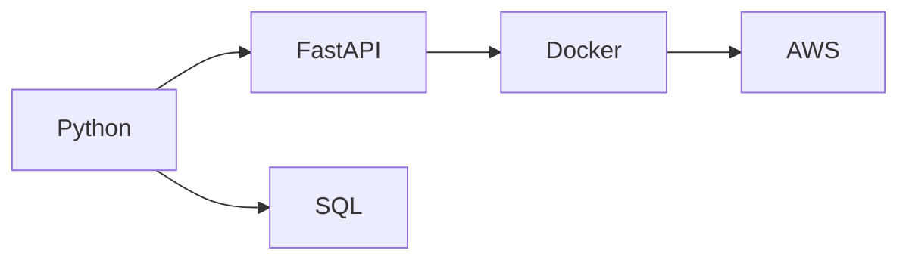

You're asking *exactly* the right question:
**What would Stacklava offer that StackShare doesn’t?**
And the answer is actually **a lot**, because StackShare is built for *teams, SaaS products, and project stacks* — not **individuals**.

Below is a clear articulation of **your unique value**, with several strong differentiators and product directions StackShare doesn’t touch.

---

# 🧁 **THE CORE INSIGHT**

**StackShare shows the tech stack of a *project/company*.
Stacklava shows the tech stack of *a person*.**

That difference alone opens up an entirely new use case:
👉 **visual personal competency mapping**
👉 **resume generation**
👉 **skills progression tracking**
👉 **self-knowledge and visualization**
👉 **learning roadmaps**

StackShare does **none** of those.

Let’s break it down.

---

# 🔥 **1. Stacklava focuses on *you* (your skills, proficiency, experience)**

StackShare tools show:

* What companies use
* Alternatives / comparisons
* SaaS service categories
* Integrations

But Stacklava can show:

### ✔ your competencies

### ✔ your proficiency levels

### ✔ your experience timelines

### ✔ your certifications

### ✔ your learning goals

### ✔ your personal stack identity

*Think:*
**“Show me what I know, not what a project uses.”**

This is extremely powerful for resumes, personal sites, and career planning.

---

# 🔥 **2. Stacklava can generate *personalized resumes dynamically***

Something StackShare does **NOT** do.

Your system could take a YAML like:

```yaml
skills:
  python:
    level: expert
    years: 6
  docker:
    level: intermediate
    years: 3
  aws:
    level: beginner
projects:
  - name: Portfolio API
    stack: [python, fastapi, docker, aws]
```

And generate:

* A **Mermaid/D2 diagram** of your skills
* A **JSON resume** (standard schema)
* A **LaTeX or markdown resume**
* A **LinkedIn-ready summary**
* A **visual career heatmap**

This is a *killer feature*.

---

# 🔥 **3. Stacklava can handle *proficiency metadata* StackShare ignores**

Example:

| Tech   | Proficiency  | Years | Last Used |
| ------ | ------------ | ----- | --------- |
| Python | Expert       | 6     | 2025      |
| SQL    | Intermediate | 4     | 2024      |
| AWS    | Beginner     | 1     | 2023      |

StackShare does not track **levels**, **recency**, **breadth vs depth**, or **timeline**.

Stacklava *can*.

---

# 🔥 **4. Stacklava enables *visual self-assessment diagrams***

StackShare shows comparisons *between tools*.
Stacklava can show relationships *between your skills*.

Examples:

### ➤ A competency map (D2/Mermaid)



### ➤ A radar chart (later)

For categories: backend, frontend, cloud, devops, data.

### ➤ A “layers of confidence” chart

Stacklava (like baklava!) makes sense as *layers*:

* **Core skills**
* **Supporting skills**
* **Tools & frameworks**
* **Cloud / DevOps**
* **Soft skills**

StackShare cannot visualize a person like this.

---

# 🔥 **5. Stacklava can track personal growth**

You could store snapshots:

```
2023:
  python: intermediate
  docker: beginner

2024:
  python: expert
  docker: intermediate
  aws: beginner
```

Then generate **growth diagrams**.

StackShare has no concept of time progression for skills.

---

# 🔥 **6. Stacklava can export for resumes, portfolios, personal sites**

Outputs Stacklava could generate:

* JSON Resume schema
* Markdown resume
* PDF resume (via Quarto)
* GitHub profile README
* LinkedIn summary text
* Personal “Stack Page” (`stacklava.gui` later)

StackShare cannot create resumes or personal profiles that reflect proficiency.

---

# 🔥 **7. Stacklava can infer learning paths & gaps**

Once you categorize your stack, Stacklava can help answer:

* *“What should I learn next?”*
* *“What skills am I missing for cloud roles?”*
* *“Which tools do my preferred jobs require?”*

StackShare cannot do personalized recommendations.

---

# 🔥 **8. Stacklava is local-first & customizable**

StackShare is SaaS → locked to their UI and backend.

Stacklava can be:

* CLI-first
* offline
* open text formats (YAML, JSON)
* personalized templates
* themable diagrams
* exportable & scriptable

This appeals to developers.

---

# 🧠 **10 Differentiators in one list**

Stacklava can do things StackShare *does not*:

1. Personal skill tracking
2. Resume generation (PDF, MD, JSON Resume)
3. Proficiency levels & years of experience
4. Timeline tracking
5. Visual skill maps (Mermaid/D2)
6. Local-first YAML configs
7. Learning goals & recommendations
8. “Stack identity” for individuals
9. Portfolio integration (GitHub repos → stack inference)
10. Lightweight CLI workflow

**Stacklava = Personal Developer Stack Visualization + Career Toolkit**
**StackShare = SaaS Tool Catalog + Project Stack Explorer**

---

# 🎯 **So what is Stacklava really? (Positioning)**

### **Stacklava is a personal “tech profile generator” that:**

* visualizes your skills
* tracks your experience
* creates resume-ready diagrams/layouts
* helps you understand your personal stack structure
* grows with you
* is local and private

### A tagline:

**“Stacklava — visualize your skill stack, grow your career.”**

StackShare doesn’t compete in this space at all.

---

# 🚀 Want next steps?

I can help you:

* define the **core YAML schema** for personal stacks
* write the **MVP CLI** that converts it into a visual diagram
* generate **resume outputs automatically**
* draft a **Pitch / README** for Stacklava
* design a **logo/theme** based on layers (like baklava)

Just say: *“Help me design the Stacklava MVP schema”* or *“Generate the README”*.
