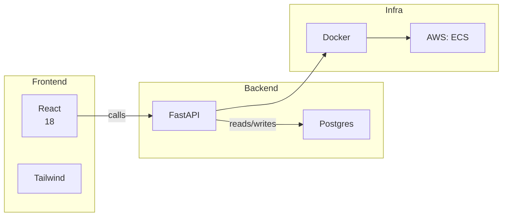

Love the name — **Stacklava** 🥮 — tasty and layered. Below I’ll simplify your idea into a focused **MVP** you can build this weekend, plus ready-to-use files/snippets (CLI, YAML schema, Mermaid template, Dockerfile, deps, and next steps). I’ll be pragmatic: start CLI-first, generate Mermaid markup, and optionally export to PNG/SVG using `mmdc` (Mermaid CLI). Ready? Let’s melt it down.

---

# Goal (one-sentence)

A CLI tool that **turns a user-defined tech stack into a clear visual diagram** (Mermaid) and can export HTML/SVG/PNG — fast to build, easy to extend.

---

# MVP (what to build first — high priority)

1. `stacklava init` → create example YAML stack file
2. `stacklava show` → render Mermaid text to terminal / open simple HTML preview
3. `stacklava export --format svg|png|html` → export diagram file (via mermaid-cli)
4. YAML config parsing and simple validation
5. Dockerfile so the CLI + exporter runs portably

Lower-priority (later): interactive builder, remote lookups, web UI, presets, plugin support.

---

# CLI UX (commands)

```
stacklava init [--file stack.yaml]          # write example stack YAML
stacklava validate <stack.yaml>             # validate schema
stacklava show <stack.yaml>                 # print Mermaid to stdout / open HTML preview
stacklava export <stack.yaml> -o out.svg     # export to svg/png/html
stacklava serve <stack.yaml> [--port 8000]  # optional local HTML server preview
```

---

# Minimal YAML schema (simple, expressive)

Save as `stack.yaml`:

```yaml
name: "My Stack"
direction: LR     # LR, TB, etc. (controls Mermaid direction)
layers:
  - name: "Frontend"
    items:
      - name: "React"
        version: "18"
      - name: "Tailwind"
  - name: "Backend"
    items:
      - name: "FastAPI"
      - name: "Postgres"
  - name: "Infra"
    items:
      - name: "Docker"
      - name: "AWS: ECS"
links:
  - from: "Frontend.React"
    to: "Backend.FastAPI"
    label: "calls"
  - from: "Backend.FastAPI"
    to: "Backend.Postgres"
    label: "reads/writes"
```

Notes:

* Entities named `Layer.Item` so you can target specific nodes in labels.
* `links` optional; if unspecified, generator tries to infer sensible edges (e.g., connect layer→layer or item→item).

---

# Mermaid Jinja2 template (mermaid.j2)

This will let you style and group tables as subgraphs (gives grouping visual effect). Save `templates/mermaid.j2`:

```jinja
%% Generated by Stacklava
erDiagram  %% you can also use flowchart depending on style

%% Use graph layout if you prefer boxes & grouping:
graph {{ stack.direction | default("LR") }}


  subgraph {{ layer.name | replace(" ", "_") }}
    direction {{ stack.direction | default("LR") }}
    
      {{ layer.name | replace(" ", "_") }}_{{ loop.index }}["{{ item.name }}"\\n{{ item.version }}]
    
  end



  
  
  {{ from_parts[0] | replace(" ","_") }}_{{ from_parts[1:] and (stack.layers | selectattr('name','equalto', from_parts[0]) | first).items | map(attribute='name') | list | index(from_parts[1]) + 1 or 1 }} -->|{{ link.label }}| {{ to_parts[0] | replace(" ","_") }}_{{ to_parts[1:] and (stack.layers | selectattr('name','equalto', to_parts[0]) | first).items | map(attribute='name') | list | index(to_parts[1]) + 1 or 1 }}

```

> The template above uses `subgraph` + nodes to give grouped layout. (You can use a simpler `flowchart` or `graph TB` depending on visual taste.)

---

# Example Mermaid output (quick sample)

If you prefer a direct small example (paste into mermaid.live or into a `.mmd`):



---

# Python snippets (ready-to-copy)

### `requirements.txt`

```
click
PyYAML
Jinja2
python-dotenv      # optional
```

### `src/main.py` (Click CLI)

```python
# src/main.py
import sys
import subprocess
import webbrowser
import click
from .stack_parser import load_stack
from .diagram_generator import render_mermaid, export_mermaid

@click.group()
def cli():
    pass

@cli.command()
@click.argument('file', type=click.Path(exists=True))
def show(file):
    stack = load_stack(file)
    mer = render_mermaid(stack)
    click.echo(mer)   # show raw mermaid
    # Optional: write temp HTML and open in browser
    html = f"<html><body><pre>{mer}</pre></body></html>"
    with open('stacklava_preview.html','w') as f:
        f.write(html)
    webbrowser.open('stacklava_preview.html')

@cli.command()
@click.argument('file', type=click.Path(exists=True))
@click.option('-o','--output', default='out.svg')
@click.option('--format', 'fmt', default='svg', type=click.Choice(['svg','png','mmd','html']))
def export(file, output, fmt):
    stack = load_stack(file)
    mer = render_mermaid(stack)
    if fmt == 'mmd':
        open(output,'w').write(mer)
        click.echo(f"Wrote {output}")
        return
    export_mermaid(mer, output, fmt)
    click.echo(f"Exported {output}")

if __name__ == '__main__':
    cli()
```

### `src/stack_parser.py`

```python
# src/stack_parser.py
import yaml

def load_stack(path):
    with open(path) as fh:
        data = yaml.safe_load(fh)
    # minimal validation
    if 'layers' not in data:
        raise ValueError("stack must contain 'layers'")
    return data
```

### `src/diagram_generator.py`

```python
# src/diagram_generator.py
from jinja2 import Environment, FileSystemLoader
import subprocess
import tempfile
import os

TEMPLATE_DIR = os.path.join(os.path.dirname(__file__), '..', 'templates')
env = Environment(loader=FileSystemLoader(TEMPLATE_DIR))

def render_mermaid(stack):
    tmpl = env.get_template('mermaid.j2')
    return tmpl.render(stack=stack)

def export_mermaid(mermaid_text, out_path, fmt='svg'):
    # using mermaid-cli (mmdc). must be installed: npm i -g @mermaid-js/mermaid-cli
    with tempfile.NamedTemporaryFile('w', suffix='.mmd', delete=False) as tmp:
        tmp.write(mermaid_text)
        tmpname = tmp.name
    cmd = ['mmdc', '-i', tmpname, '-o', out_path]
    if fmt == 'png':
        cmd += ['-t', 'default']
    subprocess.check_call(cmd)
    os.unlink(tmpname)
```

> Note: `export_mermaid` depends on `mmdc` (Mermaid CLI). If you prefer a pure-Python export path, we can instead generate an HTML + embed Mermaid.js and use headless Chromium to render screenshots — more tooling but also possible.

---

# Dockerfile (simple, includes node for `mmdc`)

```dockerfile
FROM python:3.11-slim

# install Node (for mermaid-cli) and dependencies
RUN apt-get update && apt-get install -y curl gnupg build-essential \
  && curl -fsSL https://deb.nodesource.com/setup_18.x | bash - \
  && apt-get install -y nodejs \
  && npm install -g @mermaid-js/mermaid-cli \
  && apt-get clean && rm -rf /var/lib/apt/lists/*

WORKDIR /app
COPY requirements.txt .
RUN pip install --no-cache-dir -r requirements.txt

COPY . /app
ENTRYPOINT ["python", "-m", "src.main"]
```

`docker-compose.yml` can mount local stack file and run `stacklava export`.

---

# Quick dev run (on your machine)

1. create virtualenv, install deps:

```bash
python -m venv .venv
source .venv/bin/activate
pip install -r requirements.txt
npm i -g @mermaid-js/mermaid-cli
```

2. init example: `stacklava init` (you can implement write example YAML)
3. export: `stacklava export stack.yaml -o stack.svg`

---

# Project structure (refined)

```
stacklava/
├── src/
│   ├── __init__.py
│   ├── main.py
│   ├── stack_parser.py
│   ├── diagram_generator.py
│   └── cli_helpers.py
├── templates/
│   └── mermaid.j2
├── tests/
│   └── test_parser.py
├── Dockerfile
├── docker-compose.yml
├── requirements.txt
└── README.md
```

---

# Testing plan (small)

* unit test `load_stack()` with valid/invalid YAML
* test `render_mermaid()` returns non-empty string and contains `graph` or `subgraph` tokens
* integration test: `export_mermaid()` produces file (skip when `mmdc` missing)

---

# Roadmap (3-phase)

**Phase 0 (weekend MVP)**: CLI + YAML + Mermaid template + mmdc export + Dockerfile.
**Phase 1**: interactive `stacklava add` builder, presets, theme support, HTML previews.
**Phase 2**: server / web UI, plugin system (connect to GitHub repos, CI badges), shareable visualizations, import from Lucid/dbml.

---

# Risks / caveats & alternatives

* **Mermaid layout limitations** — grouping via `subgraph` or flowchart is hacky; for advanced control consider D2 (you were looking at D2 earlier) — D2 supports field-level control and Quarto integration. If you want more precise diagrams later, switching to D2 is easy since your stack data is structured.
* Export relies on `mmdc` or headless browser; bundling this in Docker increases image size (node + chromium).

---

# Next actions I can do immediately (pick one)

* Convert your Lucidchart export into the `stack.yaml` and a ready Mermaid or D2 diagram.
* Generate a complete, copy-ready `main.py`, `diagram_generator.py`, `mermaid.j2`, and `Dockerfile` file content in a zip.
* Show a prettier Mermaid template (colors, badges, icons) to match the “baklava” brand.

Which would you like me to produce now?
